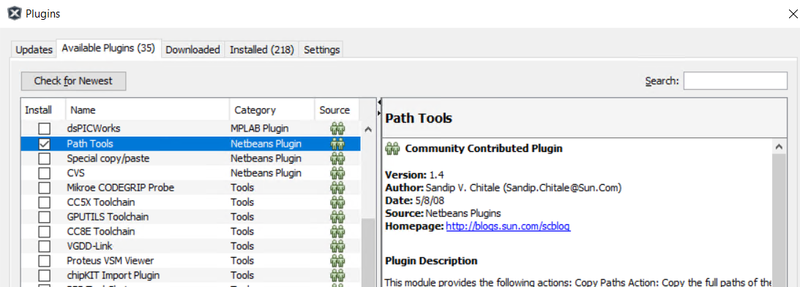
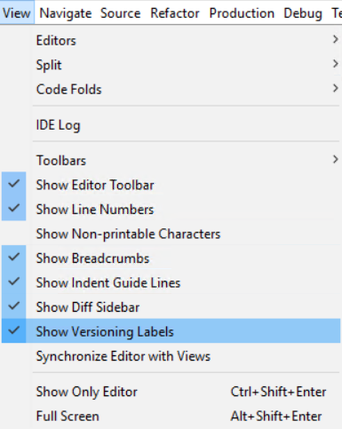
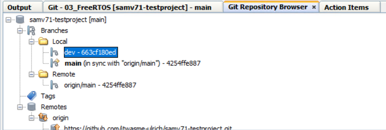
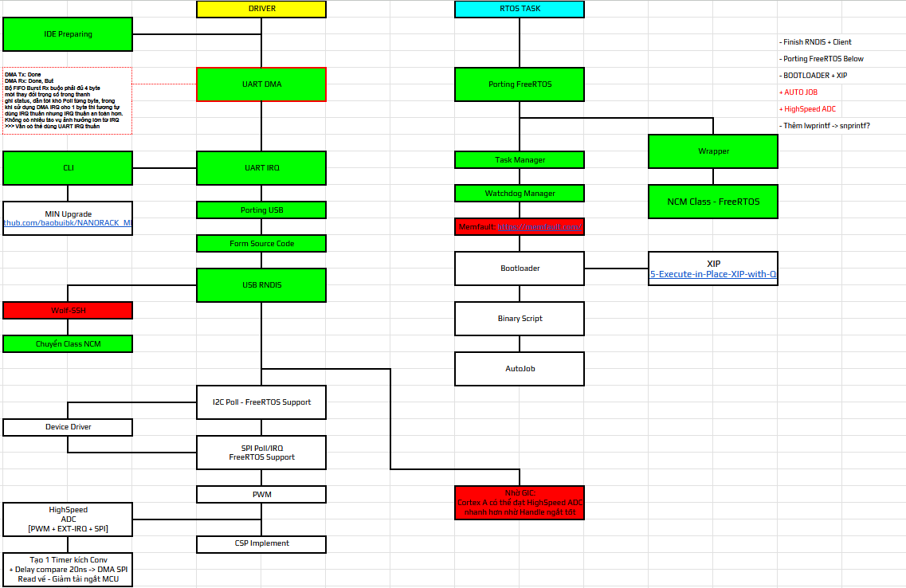

# SAM-EXP MCU Source
This is code for SAM-EXP-MCU/ATSAMV71-based boards

## Summary
- Target: ATSAMV71Q21B (SAMV71)
- OS: FreeRTOS
- Support: UART CLI, USB Network CLI, some library included
- Contents: boot manager, drivers, middleware, utilities and tests (see `src/`)

## How to test
- Open UART console: 115200 8N1 and check boot logs
- Check USB enumeration and basic peripherals
- Run ncat to [192.168.6.8:2323] if board network is configured

## TeamWork with MPLAB X IDE

### 1. Pre-check
    - Check "Path Tools" must be installed


    - Enable "View Versioning"



### 2. Clone
    - Team > Git > Clone...
    - Paste link Git repo: Eg [https://github.com/itwasme-ulrich/samv71-testproject.git]
    - Open project

### 3. Dev Branch
    - Target to Project and Right click:
    - Git > Branch/Tag > Create Branch...
    - Add name [dev-branch]
    - Tick to [Checkout Branch] -> Check out immediately
  


### 4. Commit
    - When done, commit to branch following: Right Click to Project, Git > Commit...
    - **ADD GIT COMMIT MESSAGE**
    - Commit --> Local save

### 5. Push
    - Target to project, Git > Remote > Push...

### 6. Pull
    - Target to project, Git > Remote > Pull...

### 7. Merge Request / Pull Request
    - !!! It is highly recommended using Browser/GitApp for this step

## Upcoming

- Add more driver
- XIP/Bootloader

## Changelog

### 07/01/2026
```
-> Sum: Release version for test
[Add] initial test release
```