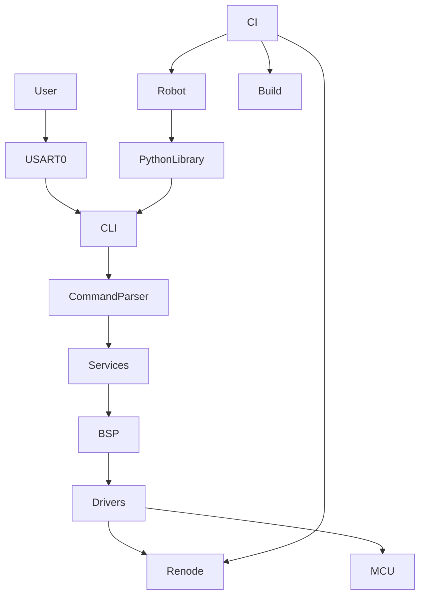

# Architecture Overview

The project is organized around a CLI-driven validation flow.

## Practical interpretation

- `USART0` is the main engineering console
- CLI commands are part of both manual bring-up and automated testing
- simulation is used for early validation
- hardware testing is added later for timing-sensitive and peripheral-accurate checks
